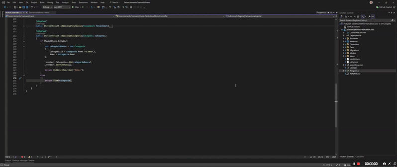

# 💰 Sistema de Gerenciamento Financeiro

Aplicação web desenvolvida com **ASP.NET Core MVC** para controle de **ganhos e gastos**, permitindo organizar transações financeiras, categorias e visualizar um resumo dos valores.

Este projeto foi criado com o objetivo de **praticar desenvolvimento backend com .NET**, estruturação de aplicações no padrão **MVC** e manipulação de dados com **Entity Framework Core**.

## Demonstração



## 📌 Funcionalidades

- Cadastro de **transações financeiras**
- Registro de **ganhos e despesas**
- Cadastro e gerenciamento de **categorias**
- **Filtros por data e tipo de transação**
- Visualização de **totais de ganhos, gastos e saldo**
- Operações completas de **CRUD**

---

## 🛠 Tecnologias utilizadas

- **ASP.NET Core MVC**
- **C#**
- **Entity Framework Core**
- **SQL Server**
- **Razor**
- **Bootstrap**

---

## 🧠 Conceitos praticados

- Arquitetura **MVC**
- CRUD completo
- Manipulação de dados com **Entity Framework**
- Relacionamento entre entidades
- Filtros de dados
- Organização de controllers, models e views

---

## ▶ Como executar o projeto

### 1️⃣ Clonar o repositório

```bash
git clone https://github.com/seu-usuario/seu-repositorio.git
